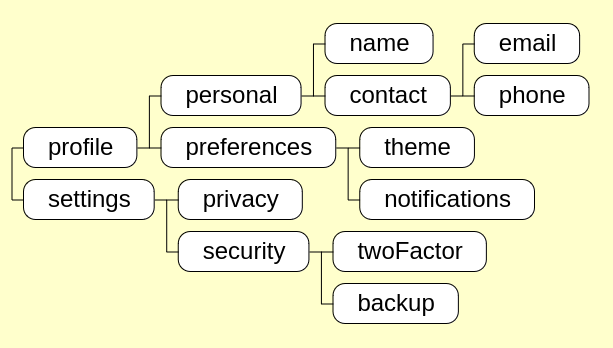

# Tree structure visualizer

This is a tool that given a JSON-represented tree(or forest) structure and then generate a representation image.

[Demo page](https://cindylinz.github.io/Web-TreeVisualizer/)

The input format is a specialized JSON like this:

```JSON
{ "user":
  { "profile":
    { "personal":
      { "name": {}
      , "contact":
        { "email": {}
        , "phone": {}
        }
      }
    , "preferences":
      { "theme": {}
      , "notifications": {}
      }
    }
  , "settings":
    { "privacy": {}
    , "security":
      { "twoFactor": {}
      , "backup": {}
      }
    }
  }
}
```

and generate an image like this:



The order of the siblings matters.
